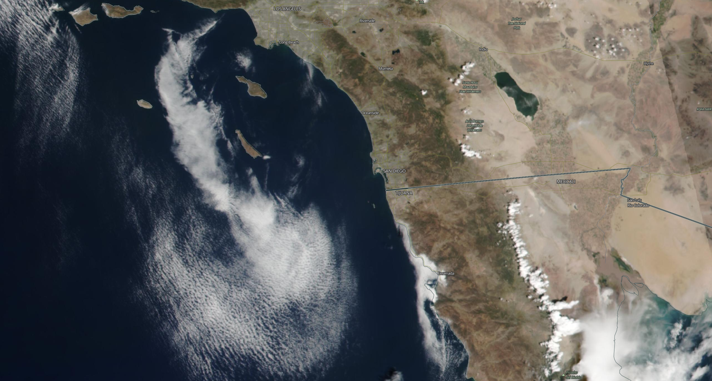
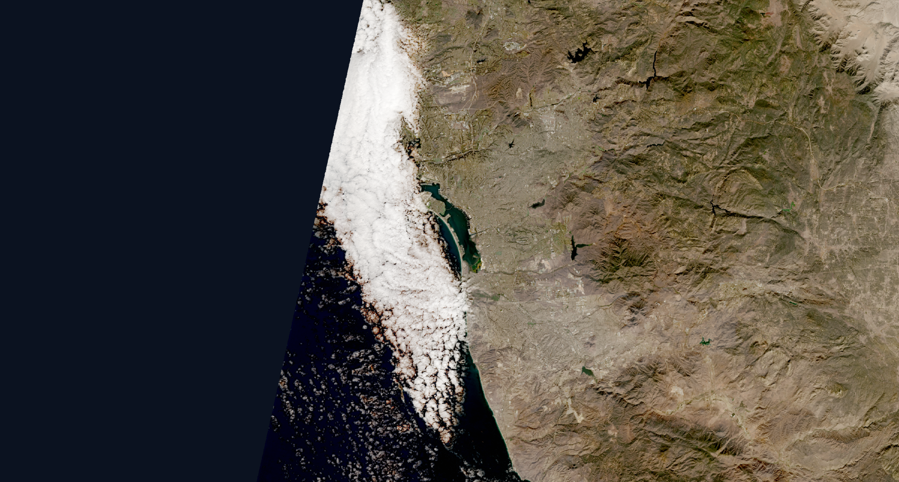

```{css, echo=FALSE}
/* Colores de Static Shock la caricatura de Cartoon Network!  */

.navbar {
  background-color: #0A2A4A !important;   
  border-bottom: 3px solid #FFD700;        
}

.navbar-brand, 
.navbar-nav > li > a {
  color: #FFD700 !important;              
  font-weight: 600;
}

.navbar-nav > li > a:hover,
.navbar-nav > li > a:focus {
  color: #FFF176 !important;
  background-color: #0D3A63 !important;
}

.navbar-nav > .active > a,
.navbar-nav > .active > a:hover,
.navbar-nav > .active > a:focus {
  background-color: #061A2E !important;    
  color: #FFD700 !important;
  font-weight: 700;
}
```


```{r setup, include=FALSE}
library(flexdashboard)
library(dplyr)
library(lubridate)
library(shiny)
library(plotly)
library(DT)
library(maps)
library(sf)
library(ggplot2)
library(dplyr)
source("modules/value_box_module_demand_total.R")
source("modules/usmap.R")
source("modules/fuel_mix.R")
source("modules/capacity_vs_demand.R")
source("modules/forecast.R")
source("modules/usmap_sales.R")
source("modules/value_box_sales.R")
source("modules/bar_graphs_sales.R")
source("modules/incidents.R")
source("modules/value_boxes_outages.R")
source("modules/prediction_renewable.R")
source("modules/fuel_mix_historic_per_day.R")

data <- read.csv("data/hourly_demand_subregion.csv", stringsAsFactors = FALSE)
data_generation_by_energy_source <- read.csv("data/hourly_generation_by_energy_source.csv", stringsAsFactors = FALSE)
state_generation_capacity <- read.csv("data/state_generator_capacity.csv",stringsAsFactors = FALSE)
daily_hour_demand <- read.csv("data/daily_hourly_all.csv",stringsAsFactors=FALSE)
sales_monthly <- read.csv("data/sales_to_customers_monthly.csv",stringsAsFactors=FALSE)
sales_quarterly <- read.csv("data/sales_to_customers_quarterly.csv",stringsAsFactors=FALSE)
indicents_df <- read.csv("data/odin_real_time_outages_county.csv",stringsAsFactors = FALSE)
fuel_mix_historico <- read.csv("modules/machine_learning/ml_data/daily_hourly_historic_energy_source.csv",stringsAsFactors = FALSE)

```

Demanda por hora
===============================


Column {data-width=300}
-----------------------------------------------------------------------

### 

```{r}
make_current_month_box(data)
```

### Chart B

```{r}
summary = get_mwh_summary(data)
create_value_box(summary)

```

### 


```{r}
make_fuel_mix(data_generation_by_energy_source)
```

### 


```{r}
capacity_vs_demand(state_generation_capacity,data)
```


Column {data-width=700}
-------------------------------------------------------------

### 


```{r}
make_us_map(data)

```


###

```{r}
make_forecast(daily_hour_demand)
```

Ventas {data-orientation=rows}
===============================


Row {data-height=150}
-----------------------------------------------------------------------

### 
```{r}
make_current_month_box(sales_monthly)
```

Row {data-height=100}
-----------------------------------------------------------------------

### 

```{r}
make_value_box_total_revenue_month(sales_monthly)
```
### 

```{r}
make_value_box_total_customers_month(sales_monthly)
```

### 

```{r}
make_value_box_total_sales_month(sales_monthly)
```

Row {data-height=700}
-----------------------------------------------------------------------

### 

```{r}
make_revenue_quarters_yoy(sales_quarterly)
```

### 

```{r}
make_sector_decomposition_bars(sales_monthly)
```


Row {data-height=1000}
-----------------------------------------------------------------------

### 

```{r}
make_usmap_sales(sales_monthly)
```


Apagones {data-orientation=rows}
===============================


Row {data-height=5}
-----------------------------------------------------------------------

###

```{r}
make_value_box_incidents(indicents_df)
```


###

```{r}
make_state_with_most_problems(indicents_df)
```


Row {data-height=75}
-----------------------------------------------------------------------

### 
```{r}
make_incidents_map(indicents_df)
```


Row {data-height=20}
----------------------------------------------------------------------


###

```{r}
make_status_bar_graph(indicents_df)
```

###

```{r}
make_causes_bar_graph(indicents_df)
```


Renovables {}
===============================


Column {data-width=300}
-----------------------------------------------------------------------


###

```{r}
valueBox(
    value    = paste0("Buen día para renovables"),
    icon     = "fa-thumbs-up",
    color    = "success"
  )

```

### 


```{r}

```


###

```{r}
make_fuel_mix_per_day(fuel_mix_historico,"2026-09-11")

```


Column {data-width=300}
-----------------------------------------------------------------------


###

```{r}
valueBox(
    value    = paste0("Mal día para renovables"),
    icon     = "fa-thumbs-down",
    color    = "danger"
  )

```


###

```{r}

```


###

```{r}
make_fuel_mix_per_day(fuel_mix_historico,"2019-11-07")

```


Column {data-width=300}
-----------------------------------------------------------------------

###

```{r}
valueBox(
    value    = paste0("Predicción siguientes días"),
    color    = "info"
  )

```


### 

 
```{r}
make_prediction_renewables(data_generation_by_energy_source)
```


